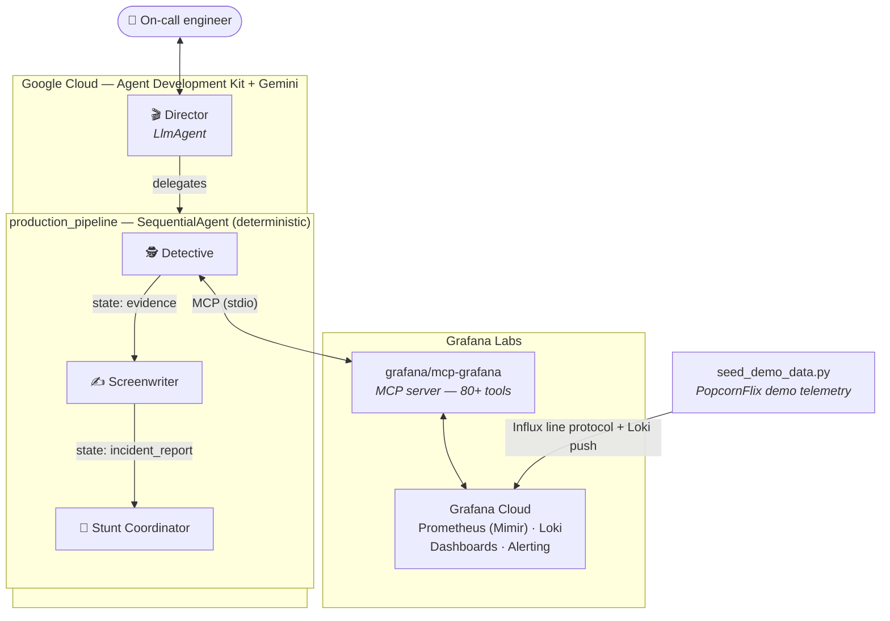

# 🎬 Incident Film Crew

**A multi-agent AI incident responder that keeps streaming platforms on air.**

Built for the [Agentic Cinema: The Blockbuster Hackathon](https://agentic-cinema.devpost.com/)
— **Grafana Labs track** — with Gemini on Google Cloud (Agent Development Kit)
and the official Grafana MCP server.

## The problem

When a live premiere starts buffering, every minute of downtime costs a
streaming platform viewers, refunds, and reputation. On-call engineers burn
that time hopping between dashboards, log queries, and alert screens before
they can even *describe* the incident, let alone fix it.

**Incident Film Crew** compresses that first hour into minutes: a
deterministic pipeline of Gemini agents investigates the incident against
live Grafana Cloud telemetry, writes the incident report, and delivers a
ranked action plan — ending with a one-line verdict: *can the premiere
continue?*

## The crew

| Agent | Role |
|---|---|
| 🎬 **Director** | Talks to the user, triggers the pipeline, presents the final cut |
| 🕵️ **Detective** | Queries Grafana via MCP — Prometheus metrics, Loki logs, dashboards, alert rules — and reports hard evidence |
| ✍️ **Screenwriter** | Turns evidence into a structured SEV-rated incident report |
| 🔧 **Stunt Coordinator** | Proposes mitigations, permanent fixes, and preventive Grafana alert rules |

## Architecture



The three-stage pipeline is a **deterministic, multi-step workflow**: ADK's
`SequentialAgent` guarantees the order (evidence → report → action plan) and
passes each stage's output to the next via session state — no free-form agent
wandering.

## Tech stack

- **AI:** Gemini via [Google ADK](https://google.github.io/adk-docs/)
  (`google-adk`, `google-genai`) on Vertex AI
- **Partner integration:** official
  [`grafana/mcp-grafana`](https://github.com/grafana/mcp-grafana) MCP server,
  loaded as an ADK `McpToolset` and called at runtime (stdio transport)
- **Observability backend:** Grafana Cloud (Mimir/Prometheus, Loki, alerting)

## Run it yourself

### Prerequisites

1. **Python 3.10+**
2. **Google Cloud project** with the Vertex AI API enabled and
   [`gcloud` CLI](https://cloud.google.com/sdk/docs/install) authenticated:
   ```bash
   gcloud auth application-default login
   gcloud services enable aiplatform.googleapis.com
   ```
   (Alternatively set `GOOGLE_API_KEY` from
   [AI Studio](https://aistudio.google.com/apikey) and
   `GOOGLE_GENAI_USE_VERTEXAI=FALSE` — note free-tier rate limits are too low
   for full pipeline runs.)
3. **Grafana Cloud stack** (free tier works) and a service account token:
   Administration → Users and access → Service accounts → Add account (role:
   Admin) → Add token
4. **Grafana MCP server binary** from
   [releases](https://github.com/grafana/mcp-grafana/releases) (or
   `go install github.com/grafana/mcp-grafana/cmd/mcp-grafana@latest`)

### Setup

```bash
git clone https://github.com/ThatoFrancis/incident-film-crew.git
cd incident-film-crew
pip install -r requirements.txt
cp .env.example .env   # fill in your values
```

### Seed the demo incident (optional but recommended)

Simulates **PopcornFlix**, a streaming platform whose *Meridian Falls* live
premiere is being wrecked by a CDN config rollout in eu-west. Requires a
Grafana Cloud access-policy token with `metrics:write` + `logs:write`
(see `.env.example`).

```bash
python seed_demo_data.py   # keep running; Ctrl+C to stop
```

### Launch

```bash
adk web --port 8800
```

Open http://localhost:8800, select `incident_film_crew`, and ask:

> Viewers are reporting buffering and playback failures during the
> Meridian Falls live premiere. Investigate now.

Watch the Detective run real Prometheus/Loki/alerting queries through the
Grafana MCP server, then get the incident report and the action plan.

### Tests

```bash
python smoke_test.py        # Grafana MCP connectivity + tool inventory
python verify_demo_data.py  # seeded telemetry visible through MCP
python e2e_test.py          # full pipeline run (uses Gemini quota)
```

## What we learned

- **Deterministic beats clever.** A `SequentialAgent` pipeline with explicit
  state keys (`evidence` → `incident_report` → `action_plan`) is more
  reliable — and more explainable to an SRE team — than free-form multi-agent
  delegation.
- **MCP is a genuine abstraction win.** The Detective gets 80+ Grafana tools
  (Prometheus, Loki, dashboards, alerting, incidents) from one stdio server —
  zero custom API glue.
- **Free-tier AI quotas can't power agentic workloads.** One investigation is
  ~30 LLM calls; we moved to Vertex AI billing and added retry backoff for
  rate limits.

## License

AGPL-3.0 — see [LICENSE](LICENSE). Commercial licensing available on request.
